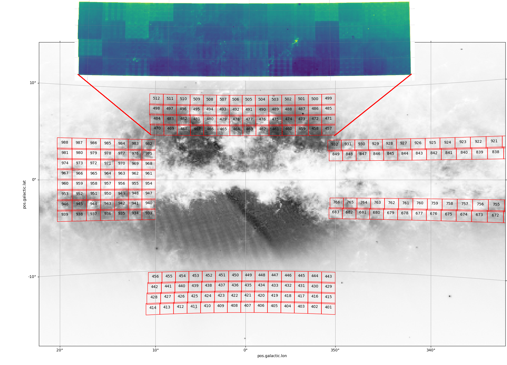

# mergeskydata

This program merges the sky data from multiple files into a single file. In particular, it can take the VVV/VVVX tiles as input and combine them into a single table. The output is a fits table containing the photometrical data for non-overlapped sources, and for overlapped sources it computes a weighted average for available photometrical bands.

## How to install

Just install the requirements  (tested on python 3.11.5)
```python
pip install -r requirements.txt
```

If you want to use a virtual environment, you can create it with
```
python -m venv venv
```
and then activate it with
```
source venv/bin/activate
```
After that install the requirements as indicated before.

# How to use

For **single use**, run:
```python
python main.py -f1 table1.fits -f2 table2.fits -o output.fits
```

To merge **multiple files**, use the bash script `script.sh` provided. It merges all the fits files inside a directory.

# Example

The image shows the VVVX tiles in Galactic coordinates (notice that the tiles overlap). In particular, tiles from 457 to 512 cover the north Galactic region of the bulge. The script in this repository merges all the tiles of this region into a single file, as shown in the image below.



Note: it took around 1 hour to merge all the tiles into a single table. It is also very RAM-consuming, so it is recommended to run it on a server with at least 64 GB of RAM for the example provided here (output file 7.8 GB).